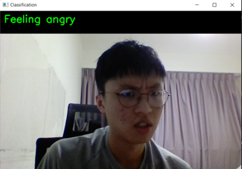

# Instructions to set up and run
## Conda
- Install Anaconda from anaconda.org
- Open Anaconda Prompt
- Run these commands and press 'y' when prompted
```
conda install -c pytorch pytorch
conda install -c huggingface transformers
python C:\\PATH_TO_THIS_FOLDER\detect.py
```
## pip
- Install Python 3.8
- Run these commands in Command Prompt
```
pip install torch
pip install transformers
python C:\\PATH_TO_THIS_FOLDER\detect.py
```

# Problem Statement

To help to raise awareness in the community and to aid in early detection of depression for individuals.


- AI Mood recogniton boost self awareness of one's emotions
- Color stripes dashboard (shareable) promotes mental health in the community
- The MoBot also acts as a companion, which comforts potentiallly depressed users by reducing their loneliness

## Original Concept

The MoBot is a companion bot that has 3 main features – Mood Detector, Reaction, Website Dashboard with shareable color stripes. The MoBot reacts differently based on the mood of the owner.

### Mood Detector
### Reaction
### Colour Stripes
### Website Dashboard

Refer to the PowerPoint attached to see how they are linked.

## Actual Prototype

Due to hardware and time contraints, we could only work on the software features.

Features are
- AI mood recognition [**Angry, Disgusted, Fearful, Happy, Neutral, Sad, Surprised.**]
    - Using a model based on Vision Transformer (ViT)
- Color stripes Dashboard
    - Using ReactJS


Missing features:
- A companion robot
- Static share button (For color stripe dashboard)

We hope that in future, with enough time and resources, we will be able to come out with the complete physical prototype.

# Demo
- ```detect.py``` is used for actual opencv detection (using pc camera - **set up required**) 
    - Constantly computes your emotion over 10 second periods
- We included a [Google Colab](https://colab.research.google.com/drive/1lxiOH5_TBMBtd0mHY0GGWz2ry9msAhVy?usp=sharing) for you guys to also try out! (**no set up required!**)
    - Gets your emotion from 1 photograph

# Code Deployment
The following is our dashboard URL. It responds based on mood detected from AI.

https://mobot-app-39805.web.app/

# Dependencies

ML libraries to install : Pillow, Transformers, PyTorch, OpenCV, NumPy


# Notes

1) Each MoBot will have their own unique website dashboard with their own color stripes representing them. The color stripes are **shareable**!

2) Dashboard auto refreshes every 30s


**need public repo when everything is done**   -- remove when done


# Images
 
<br/>

<br/>

 
